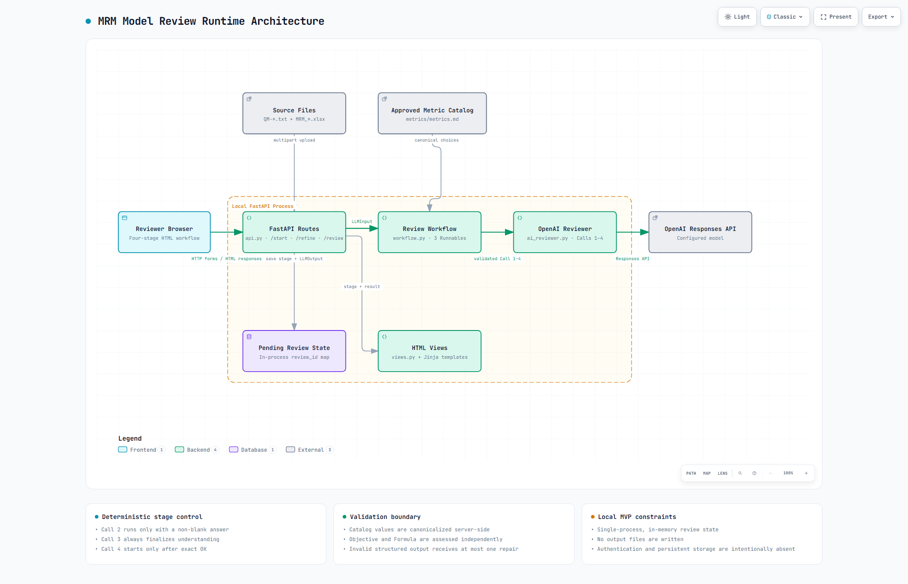

# Runtime Architecture

## Flow

Browser → FastAPI route → input reader → workflow → OpenAI reviewer → validation → browser

1. `/start` reads one QM text file and one developer workbook, then invokes Call 1.
2. `/refine` sends real answers to optional Call 2 and always invokes Call 3.
3. `/review` is available only after the exact `OK` submission and invokes Call 4.
4. Failed refinement or review keeps the same `PendingReview.stage` for retry.

## File responsibilities

- `main.py`: creates and starts the FastAPI application.
- `src/config.py`: loads the project root and OpenAI settings.
- `src/api.py`: routes and in-process review state.
- `src/user_input_reader.py`: uploaded TXT and workbook validation and parsing.
- `src/metric_catalog_reader.py`: raw catalog reading and hierarchy parsing.
- `src/schemas.py`: shared Pydantic input and output contracts.
- `src/ai_reviewer.py`: OpenAI client and four named calls.
- `src/workflow.py`: call order, one-repair policy, and output guardrails.
- `src/views.py`: safe public errors and Jinja rendering.
- `src/prompt_loader.py`: YAML prompt loading.
- `prompts/`: provider instructions for Calls 1–4.
- `metrics/metrics.md`: the only approved metric catalog.
- `templates/`: the server-rendered browser interface.

## State and boundaries

Review state is temporary and process-local. The server owns workbook values and catalog validation.
Provider prompt prose stays under `prompts/`. Credentials come only from environment variables or
`.env.local`. Review results are never written to files.

## Diagram

The editable diagram source is `diagrams/mrm-runtime-architecture.json`. Generated interactive previews,
theme variants, and visual-check receipts are local verification artifacts rather than maintained documentation.
